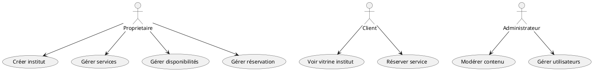
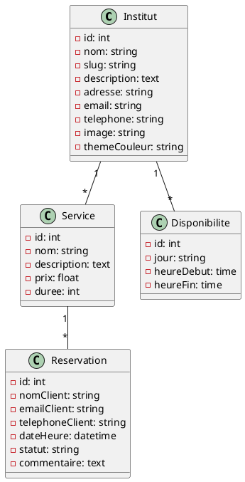
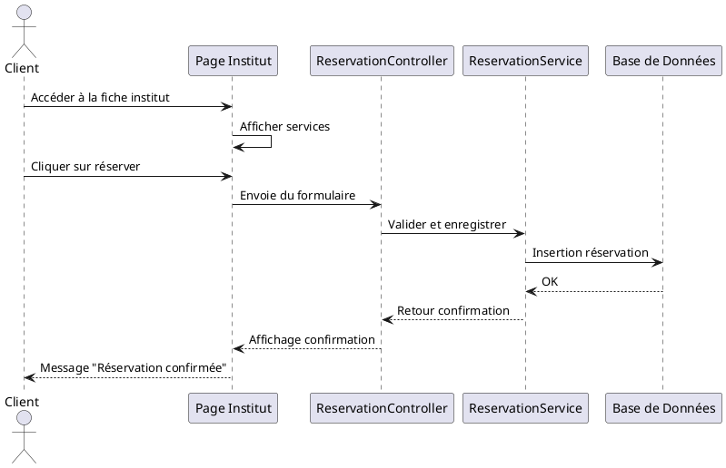
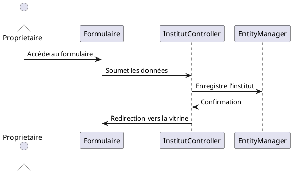
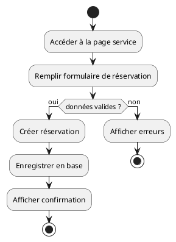
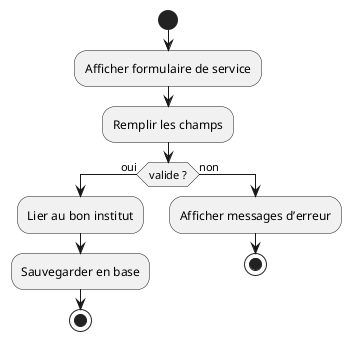
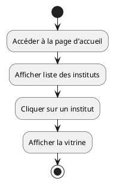

📘 README - Projet BeautifyMe

🧠 Présentation du projet

BeautifyMe est une plateforme web qui combine un CMS destiné aux propriétaires d'instituts de beauté (ou similaires) pour créer leur propre vitrine, avec un système de réservation accessible aux clients. Le projet est construit sans authentification dans sa première version.

🎯 Objectifs du projet

Offrir un espace personnalisé pour chaque institut

Centraliser la présentation de services et disponibilités

Faciliter la prise de rendez-vous pour les clients

Permettre une évolution future vers un système complet avec comptes utilisateurs, gestion, et paiements intégrés

🛠️ Technologies utilisées

Technologie

Rôle

Symfony 7

Framework backend PHP

PHP 8.3

Langage serveur

MySQL

Base de données relationnelle

Doctrine ORM

Mapping Objet-Relationnel

Twig

Moteur de templates pour les vues

Bootstrap 5

Framework CSS pour le responsive

JavaScript

Interaction frontend basique

Stripe (optionnel)

Paiement en ligne

WAMP

Environnement de développement local

✅ Fonctionnalités par type d'utilisateur

👤 Client

Parcours des instituts

Consultation des services

Réservation sans compte

🧑‍💼 Propriétaire d’institut

Création d’une vitrine via formulaire

Ajout de services

Définition des créneaux horaires

👨‍⚖️ Administrateur (à venir)

Supervision globale

Modération des contenus

Gestion des utilisateurs

🗃️ Base de données

Tables principales

Table

Rôle

Institut

Infos générales du salon

Service

Prestations proposées

Disponibilité

Horaires d’ouverture

Réservation

Données de rendez-vous client

Dictionnaire de données

Table Institut

Champ

Type

Description

id

int

Identifiant

nom

string

Nom de l’institut

slug

string

URL personnalisée

description

text

Présentation

adresse

string

Adresse physique

telephone

string

Numéro de téléphone

email

string

Email de contact

image

string

Image (lien ou nom de fichier)

themeCouleur

string

Couleur principale personnalisée

Table Service

Champ

Type

Description

id

int

Identifiant

nom

string

Nom du service

description

text

Détail

prix

float

Prix du service

duree

int

Durée en minutes

institut_id

FK

Lien vers la table Institut

Table Disponibilite

Champ

Type

Description

id

int

Identifiant

jour

string

Jour de la semaine

heureDebut

time

Heure de début

heureFin

time

Heure de fin

institut_id

FK

Lien vers la table Institut

Table Reservation

Champ

Type

Description

id

int

Identifiant

nomClient

string

Nom du client

emailClient

string

Email du client

telephoneClient

string

Téléphone

dateHeure

datetime

Date et heure du RDV

commentaire

text

Remarques (facultatif)

statut

string

Statut (attente, confirmée...)

service_id

FK

Lien vers la table Service


---

## 📚 Diagrammes UML (PlantUML)

### 1. Diagramme de cas d’utilisation



### 2. Diagramme de classes



### 3. Diagrammes de séquence

#### Réservation d’un service



#### Création d’un institut



#### Ajout d’un service à un institut

```plantuml
@startuml
actor Proprietaire
participant "Formulaire Service"
participant "ServiceController"
participant "EntityManager"

Proprietaire -> Formulaire Service : Renseigne un service
Formulaire Service -> ServiceController : Soumission du formulaire
ServiceController -> EntityManager : Persist du service
EntityManager --> ServiceController : OK
ServiceController -> Formulaire Service : Redirection vers fiche institut
@enduml
```

#### Gestion de disponibilité

```plantuml
@startuml
actor Proprietaire
participant "Formulaire Disponibilité"
participant "DisponibiliteController"
participant "EntityManager"

Proprietaire -> Formulaire Disponibilité : Choix jours/heures
Formulaire Disponibilité -> DisponibiliteController : Soumission
DisponibiliteController -> EntityManager : Persist de la disponibilité
EntityManager --> DisponibiliteController : OK
DisponibiliteController -> Formulaire Disponibilité : Retour / message
@enduml
```

#### Consultation des services (client)

```plantuml
@startuml
actor Client
participant "Page Institut"
participant "InstitutController"
participant "ServiceRepository"

Client -> Page Institut : Accède à l’institut
Page Institut -> InstitutController : Demande des services
InstitutController -> ServiceRepository : Récupération
ServiceRepository --> InstitutController : Liste de services
InstitutController -> Page Institut : Affichage des services
@enduml
```

### 4. Diagrammes d’activités

#### Réservation d’un service



#### Ajout d’un service



#### Consultation des instituts (client)



📊 Comparatif UML vs Merise

Élément

UML

Merise

Modèle de données

Diagramme de classes

MCD / MLD

Description des processus

Diagramme d’activités / séquence

Organigramme / diagramme des flux

Acteurs / Fonctions

Diagramme de cas d’utilisation

DFD (diagramme de contexte, niveau 0…)

Déploiement technique

Diagramme de déploiement

Matrice de composants (architecture)

🚀 Perspectives et améliorations

Intégration de l’authentification utilisateur

Intégration Stripe pour paiements en ligne

Tableau de bord administrateur et pro

Application mobile

🧾 Conclusion

Le projet BeautifyMe démontre la faisabilité d’une plateforme hybride CMS/réservation simple, accessible et évolutive. Il pose des fondations solides pour une application complète dans le secteur du bien-être.

📎 Annexes

Code PlantUML de tous les diagrammes (Use Case, Classe, Séquence, Activité, Composant, Déploiement)

Dictionnaire de données

Maquettes et formulaires Symfony

Captures d’écran de l’application en fonctionnement

Auteur : Étudiant en Licence SILEncadrant : [À compléter]Année : 2024–2025
